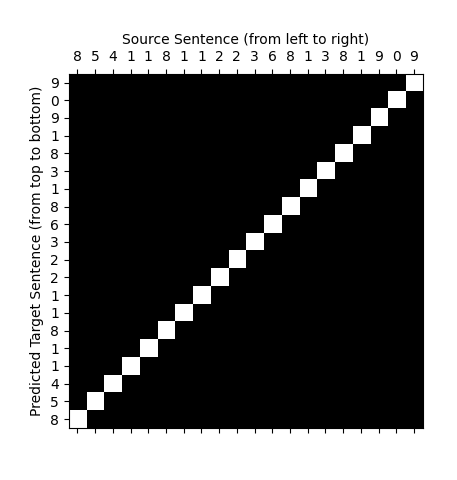

<h1 align="center">Minimal character-level seq2seq</h1>
<p align="center">An well-styled implementation in PyTorch for learners. Converge within minutes for toy datasets.</p>

<p align="center">

</p>

## Requirements

```bash
pip install gin-config torch numpy matplotlib
```

## Datasets

- Reversing 4 digits
- Reversing 20 digits
- Summing 2 integers

## Scripts

Format:

```bash
python train.py --expdir=<experiment-dir>
```

Example:

```bash
python train.py --expdir=reverse_int_long_with_attention
```

## Visualization

You can generate the attention matrix of a random example in the test set using:

```bash
python train.py --expdir=reverse_int_long_with_attention --infer
```

You can find attention matrix inside the experiment dir:


